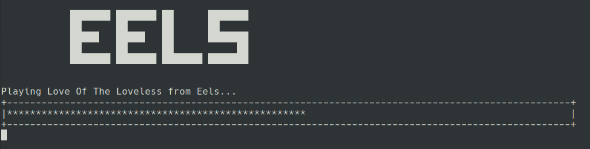

#Hands-On Spotipy

Spotipy is a lightweight Python library for the [Spotify Web API](https://developer.spotify.com/documentation/web-api/). With Spotipy you get full access to all of the music data provided by the Spotify platform.

This mini project basically does two main things:
1. Automatically opens a lovely spotify playlist from the loveliest ever music band in your browser
2. Plots the progress bar of the current playing song 

##Getting Started

All methods require user authorization. You will need to register your app at [My Dashboard](https://developer.spotify.com/dashboard/applications) to get the credentials necessary to make authorized calls (a client id and client secret).

After receiving your credentials, set your environment variables by adding the following lines to your `.bashrc` file:
```
export SPOTIPY_CLIENT_ID='your-spotify-client-id'
export SPOTIPY_CLIENT_SECRET='your-spotify-client-secret'
export SPOTIPY_REDIRECT_URI='your-app-redirect-url'
```

Please refer to [https://spotipy.readthedocs.io/en/master/](https://spotipy.readthedocs.io/en/master/) for further details on this.

There is only one requirement (`spotipy`) for this project which can be installed by executing:

```buildoutcfg
$ pip install -r requirements
```


##How to run?

Make sure you are in the main project directory. 

```
$ python main.py
```

Sample output:

